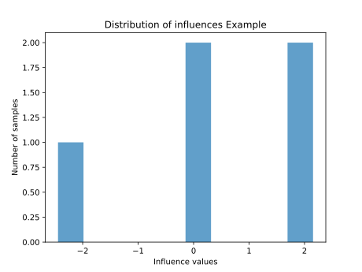
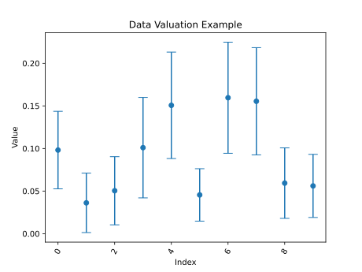

<p align="center" style="text-align:center;">
    
</p>

<p align="center" style="text-align:center;">
    A library for data valuation.
</p>

<p align="center" style="text-align:center;">
    <a href="https://pypi.org/project/pydvl/">
        
    </a>
    <a href="https://pypi.org/project/pydvl/">
        
    </a>
    <a href="https://pydvl.org">
        
    </a>
    <a href="https://raw.githubusercontent.com/aai-institute/pyDVL/master/LICENSE">
        
    </a>
    <a href="https://github.com/aai-institute/pyDVL/actions/workflows/main.yaml">
        
    </a>
    <a href="https://codecov.io/gh/aai-institute/pyDVL">
      
    </a>
    <a href="https://zenodo.org/badge/latestdoi/354117916">
        
    </a>
</p>

**pyDVL** collects algorithms for **Data Valuation** and **Influence Function** computation.

**Data Valuation** for machine learning is the task of assigning a scalar
to each element of a training set which reflects its contribution to the final
performance or outcome of some model trained on it. Some concepts of
value depend on a specific model of interest, while others are model-agnostic.
pyDVL focuses on model-dependent methods.

The **Influence Function** is an infinitesimal measure of the effect that single
training points have over the parameters of a model, or any function thereof.
In particular, in machine learning they are also used to compute the effect
of training samples over individual test points.

# Installation

To install the latest release use:

```shell
$ pip install pyDVL
```

You can also install the latest development version from
[TestPyPI](https://test.pypi.org/project/pyDVL/):

```shell
pip install pyDVL --index-url https://test.pypi.org/simple/
```

pyDVL has also extra dependencies for certain functionalities (e.g. influence functions).

For more instructions and information refer to [Installing pyDVL
](https://pydvl.org/stable/getting-started/installation/) in the
documentation.

# Usage

In the following subsections, we will showcase the usage of pyDVL
for Data Valuation and Influence Functions using simple examples.

For more instructions and information refer to [Getting
Started](https://pydvl.org/stable/getting-started/first-steps/) in
the documentation.
We provide several examples for data valuation
(e.g. [Shapley Data Valuation](https://pydvl.org/stable/examples/shapley_basic_spotify/))
and for influence functions
(e.g. [Influence Functions for Neural Networks](https://pydvl.org/stable/examples/influence_imagenet/))
with details on the algorithms and their applications.

## Influence Functions

For influence computation, follow these steps:

1. Import the necessary packages (The exact packages depend on your specific use case).

   ```python
   import torch
   from torch import nn
   from torch.utils.data import DataLoader, TensorDataset
   from pydvl.reporting.plots import plot_influence_distribution
   from pydvl.influence import compute_influences, InversionMethod
   from pydvl.influence.torch import TorchTwiceDifferentiable
   ```

2. Create PyTorch data loaders for your train and test splits.

   ```python
   torch.manual_seed(16)
   
   input_dim = (5, 5, 5)
   output_dim = 3

   train_data_loader = DataLoader(
      TensorDataset(torch.rand((10, *input_dim)), torch.rand((10, output_dim))),
      batch_size=2,
   )
   test_data_loader = DataLoader(
      TensorDataset(torch.rand((5, *input_dim)), torch.rand((5, output_dim))),
      batch_size=1,
   )
   ```

3. Instantiate your neural network model.

   ```python
   nn_architecture = nn.Sequential(
      nn.Conv2d(in_channels=5, out_channels=3, kernel_size=3),
      nn.Flatten(),
      nn.Linear(27, 3),
   )
   nn_architecture.eval()
   ```

4. Define your loss:

   ```python
   loss = nn.MSELoss()
   ```

5. Wrap your model and loss in a `TorchTwiceDifferentiable` object.

   ```python
   model = TorchTwiceDifferentiable(nn_architecture, loss)
   ```

6. Compute influence factors by providing training data and inversion method.
   Using the conjugate gradient algorithm, this would look like:

   ```python
   influences = compute_influences(
      model,
      training_data=train_data_loader,
      test_data=test_data_loader,
      inversion_method=InversionMethod.Cg,
      hessian_regularization=1e-1,
      maxiter=200,
      progress=True,
   )
   ```
   The result is a tensor of shape `(training samples x test samples)`
   that contains at index `(i, j`) the influence of training sample `i` on
   test sample `j`.

7. Visualize the results.

   ```python
   plot_influence_distribution(influences, index=1, title_extra="Example")
   ```
   
   

   The higher the absolute value of the influence of a training sample
   on a test sample, the more influential it is for the chosen test sample, model
   and data loaders. The sign of the influence determines whether it is 
   useful (positive) or harmful (negative).

> **Note** pyDVL currently only support PyTorch for Influence Functions. 
> We are planning to add support for Jax and perhaps TensorFlow or even Keras.

## Data Valuation

The steps required to compute data values for your samples are:

1. Import the necessary packages (The exact packages depend on your specific use case).

   ```python
   import matplotlib.pyplot as plt
   from sklearn.datasets import load_breast_cancer
   from sklearn.linear_model import LogisticRegression
   from pydvl.reporting.plots import plot_shapley
   from pydvl.utils import Dataset, Scorer, Utility
   from pydvl.value import (
      compute_shapley_values,
      ShapleyMode,
      MaxUpdates,
   )
   ```
 
2. Create a `Dataset` object with your train and test splits.

   ```python
   data = Dataset.from_sklearn(
       load_breast_cancer(),
       train_size=10,
       stratify_by_target=True,
       random_state=16,
   )
   ```

3. Create an instance of a `SupervisedModel` (basically any sklearn compatible
   predictor).

   ```python
   model = LogisticRegression()
   ```  

4. Create a `Utility` object to wrap the Dataset, the model and a scoring
   function.

   ```python
   u = Utility(
      model,
      data,
      Scorer("accuracy", default=0.0)
   )
   ```

5. Use one of the methods defined in the library to compute the values.
   In our example, we will use *Permutation Montecarlo Shapley*,
   an approximate method for computing Data Shapley values.

   ```python
   values = compute_shapley_values(
      u,
      mode=ShapleyMode.PermutationMontecarlo,
      done=MaxUpdates(100),
      seed=16,  
      progress=True
   )
   ```
   The result is a variable of type `ValuationResult` that contains
   the indices and their values as well as other attributes.

6. Convert the valuation result to a dataframe and visualize the values.

   ```python
   df = values.to_dataframe(column="data_value")
   plot_shapley(df, title="Data Valuation Example", xlabel="Index", ylabel="Value")
   plt.show()
   ```
   
   
   
   The higher the value for an index, the more important it is for the chosen
   model, dataset and scorer.

## Caching

pyDVL offers the possibility to cache certain results and
speed up computation. It uses [Memcached](https://memcached.org/) For that.

You can run it either locally or, using
[Docker](https://www.docker.com/):

```shell
docker container run --rm -p 11211:11211 --name pydvl-cache -d memcached:latest
```

You can read more in the
[documentation](https://pydvl.org/stable/getting-started/first-steps/#caching).

# Contributing

Please open new issues for bugs, feature requests and extensions. You can read
about the structure of the project, the toolchain and workflow in the [guide for
contributions](CONTRIBUTING.md).

# Papers

## Data Valuation

We currently implement the following papers:

- Castro, Javier, Daniel Gómez, and Juan Tejada. [Polynomial Calculation of the
  Shapley Value Based on Sampling](https://doi.org/10.1016/j.cor.2008.04.004).
  Computers & Operations Research, Selected papers presented at the Tenth
  International Symposium on Locational Decisions (ISOLDE X), 36, no. 5 (May 1,
  2009): 1726–30.
- Ghorbani, Amirata, and James Zou. [Data Shapley: Equitable Valuation of Data
  for Machine Learning](http://proceedings.mlr.press/v97/ghorbani19c.html). In
  International Conference on Machine Learning, 2242–51. PMLR, 2019.
- Wang, Tianhao, Yu Yang, and Ruoxi Jia. 
  [Improving Cooperative Game Theory-Based Data Valuation via Data Utility
  Learning](https://doi.org/10.48550/arXiv.2107.06336). arXiv, 2022.
- Jia, Ruoxi, David Dao, Boxin Wang, Frances Ann Hubis, Nezihe Merve Gurel, Bo
  Li, Ce Zhang, Costas Spanos, and Dawn Song. [Efficient Task-Specific Data
  Valuation for Nearest Neighbor Algorithms](https://doi.org/10.14778/3342263.3342637).
  Proceedings of the VLDB Endowment 12, no. 11 (1 July 2019): 1610–23.
- Okhrati, Ramin, and Aldo Lipani. [A Multilinear Sampling Algorithm to Estimate
  Shapley Values](https://doi.org/10.1109/ICPR48806.2021.9412511). In 25th
  International Conference on Pattern Recognition (ICPR 2020), 7992–99. IEEE,
  2021.
- Yan, T., and Procaccia, A. D. [If You Like Shapley Then You’ll Love the
  Core](https://ojs.aaai.org/index.php/AAAI/article/view/16721). Proceedings of
  the AAAI Conference on Artificial Intelligence, 35(6) (2021): 5751-5759.
- Jia, Ruoxi, David Dao, Boxin Wang, Frances Ann Hubis, Nick Hynes, Nezihe Merve
  Gürel, Bo Li, Ce Zhang, Dawn Song, and Costas J. Spanos. [Towards Efficient
  Data Valuation Based on the Shapley Value](http://proceedings.mlr.press/v89/jia19a.html).
  In 22nd International Conference on Artificial Intelligence and Statistics,
  1167–76. PMLR, 2019.
- Wang, Jiachen T., and Ruoxi Jia. [Data Banzhaf: A Robust Data Valuation
  Framework for Machine Learning](https://doi.org/10.48550/arXiv.2205.15466).
  arXiv, October 22, 2022.
- Kwon, Yongchan, and James Zou. [Beta Shapley: A Unified and Noise-Reduced Data
  Valuation Framework for Machine Learning](http://arxiv.org/abs/2110.14049).
  In Proceedings of the 25th International Conference on Artificial Intelligence
  and Statistics (AISTATS) 2022, Vol. 151. Valencia, Spain: PMLR, 2022.
- Kwon, Yongchan, and James Zou. [Data-OOB: Out-of-Bag Estimate as a Simple and
  Efficient Data Value](https://proceedings.mlr.press/v202/kwon23e.html). In
  Proceedings of the 40th International Conference on Machine Learning, 18135–52.
  PMLR, 2023.
- Schoch, Stephanie, Haifeng Xu, and Yangfeng Ji. [CS-Shapley: Class-Wise
  Shapley Values for Data Valuation in
  Classification](https://openreview.net/forum?id=KTOcrOR5mQ9). In Proc. of the
  Thirty-Sixth Conference on Neural Information Processing Systems (NeurIPS).
  New Orleans, Louisiana, USA, 2022.

## Influence Functions

We currently implement the following papers:

- Koh, Pang Wei, and Percy Liang. [Understanding Black-Box Predictions via
  Influence Functions](http://proceedings.mlr.press/v70/koh17a.html). In
  Proceedings of the 34th International Conference on Machine Learning,
  70:1885–94. Sydney, Australia: PMLR, 2017.
- Naman Agarwal, Brian Bullins, and Elad Hazan, [Second-Order Stochastic Optimization
  for Machine Learning in Linear Time](https://www.jmlr.org/papers/v18/16-491.html),
  Journal of Machine Learning Research 18 (2017): 1-40.
- Schioppa, Andrea, Polina Zablotskaia, David Vilar, and Artem Sokolov. 
  [Scaling Up Influence Functions](http://arxiv.org/abs/2112.03052). 
  In Proceedings of the AAAI-22. arXiv, 2021.

# License

pyDVL is distributed under
[LGPL-3.0](https://www.gnu.org/licenses/lgpl-3.0.html). A complete version can
be found in two files: [here](LICENSE) and [here](COPYING.LESSER).

All contributions will be distributed under this license.
