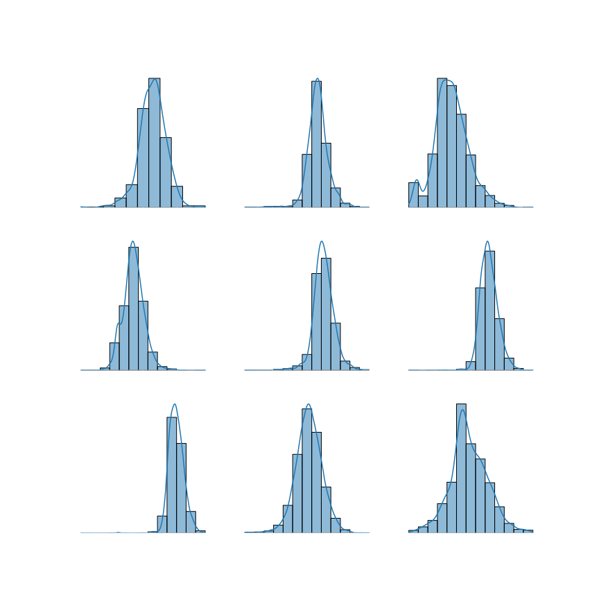

# Classwise Shapley

Classwise Shapley (CS) [@schoch_csshapley_2022] offers a distinct Shapley framework
tailored for classification problems. Let $D$ be the dataset, $D_{y_i}$ be the subset of
$D$ with labels $y_i$, and $D_{-y_i}$ be the complement of $D_{y_i}$ in $D$. The key
idea is that a sample $(x_i, y_i)$ might enhance the overall performance on $D$, while
being detrimental for the performance on $D_{y_i}$. To address this issue, the authors
introduced the estimator

$$
v_u(i) = \frac{1}{2^{|D_{-y_i}|}} \sum_{S_{-y_i}}
\left [
\frac{1}{|D_{y_i}|}\sum_{S_{y_i}} \binom{|D_{y_i}|-1}{|S_{y_i}|}^{-1}
\delta(S_{y_i} | S_{-y_i})
\right ],
$$

where $S_{y_i} \subseteq D_{y_i} \setminus \{i\}$ and $S_{-y_i} \subseteq D_{-y_i}$. In
other words, the summations are over the powerset of $D_{y_i} \setminus \{i\}$ and
$D_{-y_i}$ respectively. The function $\delta$ is called **set-conditional marginal
Shapley value** and is defined as

$$
\delta(S | C) = u( S \cup \{i\} | C ) − u(S | C),
$$

where $i \notin S, C$ and $S \bigcap C = \emptyset$. It makes sense to talk about
complexity at this point. In comparison to the original Shapley value, fewer samples are
used on average to fit the model in the score function. Although this speed-up depends
on the model, it should be at most linear in the number of data points.

```python
from pydvl.utils import Dataset, Utility
from pydvl.value import HistoryDeviation, MaxChecks, MaxUpdates, RelativeTruncation
from pydvl.value.shapley.classwise import compute_classwise_shapley_values

model = ...
data = Dataset(...)
scorer = ...
utility = Utility(model, data, scorer)
values = compute_classwise_shapley_values(
    utility,
    done=HistoryDeviation(n_steps=500, rtol=5e-2) | MaxUpdates(5000),
    truncation=RelativeTruncation(utility, rtol=0.01),
    done_sample_complements=MaxChecks(1),
    normalize_values=True
)
```

where `ClasswiseScorer` is a special type of scorer, only applicable for classification
problems. In practical applications, the evaluation of this estimator leverages both
Monte Carlo sampling and permutation Monte Carlo sampling [@castro_polynomial_2009].

### Class-agnostic score

Any estimator of the form $s(D)=\frac{1}{|D|}\sum_{i \in D} v_i$ (e.g. accuracy) can be
wrapped into a class-agnostic estimator using the provided `ClasswiseScorer` class. Each
valuation point $i$ belongs to a label set $y_i \in \mathbb{N}$. Hence, for each $i$
one has two disjoint $D_{y_i}$ and $D_{-y_i}$ datasets. The class-agnostic estimator is
then defined as

$$
u(S) = f(a_S(D_{y_i}))) g(a_S(D_{-y_i}))),
$$

where $f$ and $g$ are monotonically increasing functions. The authors showed that it
holds that $f(x)=x$ and $g(x)=e^x$ have favorable properties. For further research,
e.g. in the direction of the f1-score, we leave the option to set different $f$ and $g$
functions

```python
import numpy as np
from pydvl.value.shapley.classwise import ClasswiseScorer

identity = lambda x: x
scorer = ClasswiseScorer(
    "accuracy",
    in_class_discount_fn=identity,
    out_of_class_discount_fn=np.exp
)
```

For $f(x)=x$ and $g(x)=e^x$, the surface plot is depicted below. The x-axis
represents in-class accuracy $a_S(D_{y_i})$, and the y-axis corresponds to out-of-class
accuracy $a_S(D_{-y_i})$. The white lines illustrate the contour lines, annotated with
their respective gradients.


## Evaluation

Assessing the quality of an algorithm is crucial. Therefore, this section provides a
brief evaluation of the method using nine different datasets to evaluate the performance
of CS. The following table

| Dataset        | Data Type | Classes | Input Dims | OpenML ID |
|----------------|-----------|---------|------------|-----------|
| Diabetes       | Tabular   | 2       | 8          | 37        |
| Click          | Tabular   | 2       | 11         | 1216      |
| CPU            | Tabular   | 2       | 21         | 197       |
| Covertype      | Tabular   | 7       | 54         | 1596      |
| Phoneme        | Tabular   | 2       | 5          | 1489      |
| FMNIST         | Image     | 2       | 32         | 40996     |
| CIFAR10        | Image     | 2       | 32         | 40927     |
| MNIST (binary) | Image     | 2       | 32         | 554       |
| MNIST (multi)  | Image     | 10      | 32         | 554       |

lists all used datasets with their number of features, classes and OpenML ID. The table
is taken from [@schoch_csshapley_2022] and the same pre-processing steps are applied.
For images Principal Component Analysis (PCA) is used to obtain 32 features after
`resnet18` extracts relevant features of the images. For more details on the
pre-processing steps, please refer to the paper.

### Accuracy compared to other state-of-the-art methods

Classwise Shapley (CS) is compared to other state-of-the-art valuation methods. These
include Truncated Monte Carlo Shapley (TMC), Beta Shapley (Beta) as well as
Leave-one-out (LOO). Random values serve as a baseline. Logistic regression is used for
both the valuation and a neural network for the measurement of accuracy. The following
plot shows


the test set accuracy on the y-axis, and the number of samples removed on the x-axis.
Samples are removed high to low valuation order. A lower curve means that the first
removed values have a higher relevancy for the model. CS is competitive to the compared
methods. Especially in very unbalanced datasets, like `Click`, the performance of CS
seems superior. In other datasets, like `Covertype` and `Diabetes` and `MNIST (multi)`
the performance is on par with TMC. For `MNIST (binary)` and `Phoneme` the performance
is competitive. Is it noteworthy that for all valuation methods the same number of
marginal evaluations was used.

### Value density

This section takes a look at the density values of CS. The distribution is not uniform
or Gaussian, but is slightly biased to the right and skewed to the left. This is evident
in the following plot



where the x-axis represents values and the y-axis reveals the count. It shows the
histogram as well an approximation to the density using KDE. 