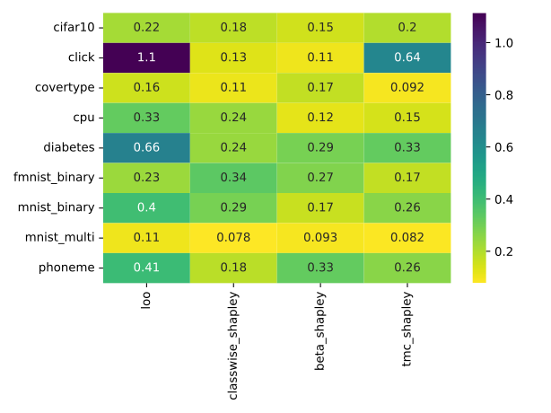

# Class-wise Shapley

Class-wise Shapley (CWS) [@schoch_csshapley_2022] offers a Shapley framework
tailored for classification problems. Let $D$ be a dataset, $D_{y_i}$ be the
subset of $D$ with labels $y_i$, and $D_{-y_i}$ be the complement of $D_{y_i}$
in $D$. The key idea is that a sample $(x_i, y_i)$ might enhance the overall
performance on $D$, while being detrimental for the performance on $D_{y_i}$. To
address this issue, the authors introduce the estimator

$$
v_u(i) = \frac{1}{2^{|D_{-y_i}|}} \sum_{S_{-y_i}}
\left [
\frac{1}{|D_{y_i}|}\sum_{S_{y_i}} \binom{|D_{y_i}|-1}{|S_{y_i}|}^{-1}
\delta(S_{y_i} | S_{-y_i})
\right ],
$$

where $S_{y_i} \subseteq D_{y_i} \setminus \{i\}$ and $S_{-y_i} \subseteq
D_{-y_i}$, and the function $\delta$ is called **set-conditional marginal
Shapley value**. It is defined as

$$
\delta(S | C) = u( S \cup \{i\} | C ) − u(S | C),
$$

where $i \notin S, C$ and $S \bigcap C = \emptyset$.

In practical applications, estimating this quantity is done both with Monte
Carlo sampling of the powerset, and the set of index permutations
[@castro_polynomial_2009]. Typically, this requires fewer samples than the
original Shapley value, although the actual speed-up depends on the model and
the dataset.


??? Example "Computing classwise Shapley values"
    ```python
    from pydvl.value import *
    
    model = ...
    data = Dataset(...)
    scorer = ClasswiseScorer(...)
    utility = Utility(model, data, scorer)
    values = compute_classwise_shapley_values(
        utility,
        done=HistoryDeviation(n_steps=500, rtol=5e-2) | MaxUpdates(5000),
        truncation=RelativeTruncation(utility, rtol=0.01),
        done_sample_complements=MaxChecks(1),
        normalize_values=True
    )
    ```


## Class-wise scorer

In order to use the classwise Shapley value, one needs to define a
[ClasswiseScorer][pydvl.value.shapley.classwise.ClasswiseScorer]. Given a sample
$x_i$ with label $y_i \in \mathbb{N}$, we define two disjoint sets $D_{y_i}$ and
$D_{-y_i}$ and define

$$
u(S) = f(a_S(D_{y_i}))) g(a_S(D_{-y_i}))),
$$

where $f$ and $g$ are monotonically increasing functions, $a_S(D_{y_i})$ is the
**in-class accuracy**, and $a_S(D_{-y_i})$ is the **out-of-class accuracy** (the
names originate from a choice by the authors to use accuracy, but in principle
any other score, like $F_1$ can be used). 

The authors show that $f(x)=x$ and $g(x)=e^x$ have favorable properties and are
therefore the defaults, but we leave the option to set different functions $f$
and $g$ for an exploration with different base scores. 

??? Example "The default class-wise scorer"
    ```python
    import numpy as np
    from pydvl.value.shapley.classwise import ClasswiseScorer
    
    # These are the defaults
    identity = lambda x: x
    scorer = ClasswiseScorer(
        "accuracy",
        in_class_discount_fn=identity,
        out_of_class_discount_fn=np.exp
    )
    ```

The level curves for $f(x)=x$ and $g(x)=e^x$ are depicted below. The white lines
illustrate the contour lines, annotated with their respective gradients.

{ align=left width=33%  class=invertible }

# Evaluation

We evaluate the method on the nine datasets used in [@schoch_csshapley_2022],
using the same pre-processing. For images, PCA is used to reduce  down to 32 the
number of features found by a `Resnet18` model. For more details on the
pre-processing steps, please refer to the paper.

??? info "Datasets used for evaluation"
    | Dataset        | Data Type | Classes | Input Dims | OpenML ID |
    |----------------|-----------|---------|------------|-----------|
    | Diabetes       | Tabular   | 2       | 8          | 37        |
    | Click          | Tabular   | 2       | 11         | 1216      |
    | CPU            | Tabular   | 2       | 21         | 197       |
    | Covertype      | Tabular   | 7       | 54         | 1596      |
    | Phoneme        | Tabular   | 2       | 5          | 1489      |
    | FMNIST         | Image     | 2       | 32         | 40996     |
    | CIFAR10        | Image     | 2       | 32         | 40927     |
    | MNIST (binary) | Image     | 2       | 32         | 554       |
    | MNIST (multi)  | Image     | 10      | 32         | 554       |

## Performance for (direct) point removal

We compare the mean and the coefficient of variation (CV) of the weighted accuracy drop 
(WAD) as proposed in [@schoch_csshapley_2022]. The metric is defined by 

$$
\text{WAD} = a_T(D) - \sum_{j=1}^{n} \frac{a_{T_{-\{1 \colon j \}}}(D)}{j},
$$

where $a_T(D)$ is the accuracy of the model (trained on $T$) evaluated on $D$ and 
$T_{-\{1 \colon j \}}$ is the set $T$ without elements from $\{1 \colon j \}$. The 
metric was evaluated over five runs and is summarized by mean $\mu_\text{WAD}$ and
standard deviation $\sigma_\text{WAD}$. The valuation of the training samples and the 
evaluation on the validation samples are both calculated based on a logistic regression 
model. Let's have a look at the mean 

{ align=left width=50%  class=invertible }

of the metric WAD. The table shows that CWS is competitive with all three other methods.
In all problems except `MNIST (multi)` it is better than TMCS, whereas in that
case TMCS has a slight advantage. Another important quantity is the CV
$\frac{\sigma_\text{WAD}}{\mu_\text{WAD}}$. It normalizes the standard
deviation relative to the mean. The results are shown below.

{ align=left width=50%  class=invertible }

It is noteworthy that CWS is not the best method in terms of CV (Lower CV means better
performance). For `CIFAR10`, `Click`, `CPU` and `MNIST (binary)` Beta Shapley has the 
lowest CV. For `Diabetes`, `MNIST (multi)` and `Phoneme` CWS is the winner and for 
`FMNIST` and `Covertype` TMCS takes the lead. Without considering LOO, TMCS has the 
highest relative standard deviation.

The following plot shows valuation-set accuracy of logistic regression on the y-axis. 
The x-axis shows the number of samples removed. Random values serve as a baseline.

{ class=invertible }

Overall we conclude that in terms of mean WAD CWS and TMCS are the best methods. In
terms of the CV CWS and Beta Shapley are the clear winners. Hence, CWS is a competitive
method for valuation of data sets with a low relative standard deviation. We remark that
for all valuation methods the same number of _evaluations of the marginal utility_ was 
used.

## Performance in value transfer for point removal

Practically more relevant is transfer of values for one model to another one. As before
the values are calculated using a logistic regression model. However, here they are 
used to prune the training set for a neural network. The following plot shows 
valuation-set accuracy of the network on the y-axis, and the number of samples removed
on the x-axis.

{ class=invertible }

Samples are removed from high to low valuation order and hence we expect a steep
decrease in the curve. CWS is competitive with the compared methods. Especially
in very unbalanced datasets, like `Click`, the performance of CWS seems
superior. In other datasets, like `Covertype` and `Diabetes` and `MNIST (multi)`
the performance is on par with TMC. For `MNIST (binary)` and `Phoneme` the
performance is competitive. We remark that for all valuation methods the
same number of _evaluations of the marginal utility_ was used.

## Density of values 

Last but not least let's compare the distribution of values for TMCS (green) and CWS
(red). Therefore, the following plots show a histogram the density estimated by kernel
density estimation (KDE). 


{ class=invertible }

As the metrics already suggest TMCS has a higher variance as CWS. In mean, they 
seem to approximate the same quantity, which is not obvious due to their different 
nature of their utility functions. 

For `Click` TMCS has a multi-modal distribution of values. This is inferior to CWS which
has only one-mode and is more stable on that dataset. `Click` is a very unbalanced 
dataset and hence CWS seems to be more robust on unbalanced datasets. It seems that
CWS is a good way to handle classification problems. Given the underlying similarities 
in the architecture of TMCS, Beta Shapley, and CWS algorithms, there's a clear pathway 
for improving convergence rates, sample efficiency, and stabilize variance in all of 
these methods.